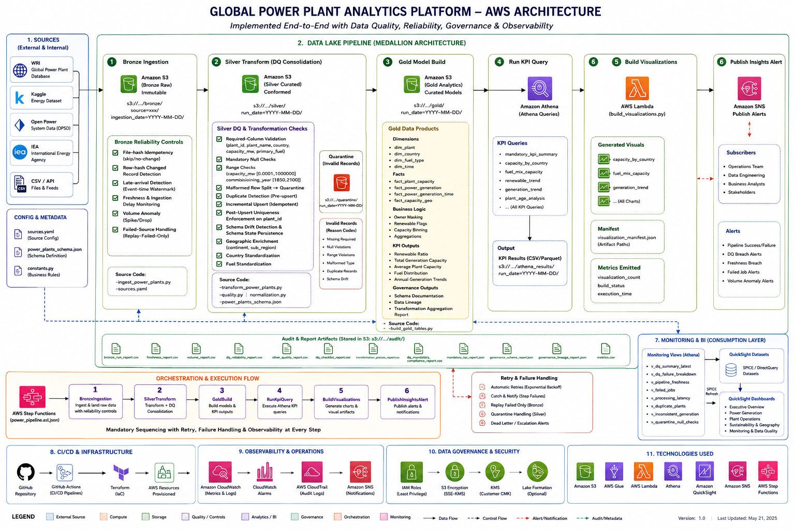
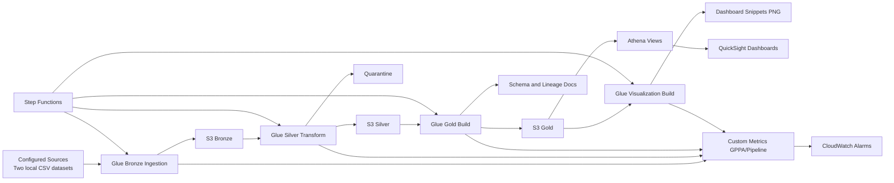
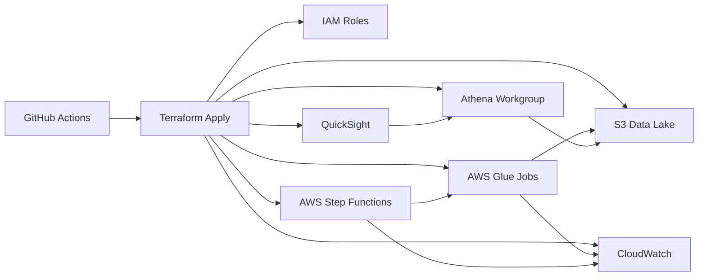

# Global Power Plant Analytics Pipeline on AWS

Production-style, cost-aware, medallion lakehouse pipeline for global power plant analytics.

## 1. What this project delivers

- Metadata-driven ingestion for CSV, JSON, Parquet, and API sources
- Incremental processing with idempotency and replay windows
- Bronze, Silver, Gold data architecture on Amazon S3 + Athena/Redshift-ready models
- Data quality checks (schema, nulls, ranges, duplicates, freshness, volume)
- Orchestration with AWS Step Functions
- Monitoring with CloudWatch metrics and alarms
- Terraform-based infrastructure with environment-scoped configuration
- CI/CD with GitHub Actions for validation and deployment

Current operational baseline:

- Active sources are restricted to two local CSV files:
  - `datasets/global_power_plants_synthetic_records_v2.csv`
  - `datasets/global_power_plants_synthetic.csv`
- Monitoring freshness is sourced from Bronze freshness audit (`audit_freshness_report`) so both configured sources are visible.
- Placeholder categorical values (`?`, `unknown`, `0`, `na`, `n/a`, `null`, etc.) are normalized out before dashboard serving.

## 2. High-level architecture

- Bronze: immutable raw files partitioned by ingest date
- Silver: standardized, deduplicated, conformed records
- Gold: dimensional and fact tables for BI and operations



See docs:

- docs/diagrams/architecture.md
- docs/adrs/0001-lakehouse-medallion.md
- docs/diagrams/architecture.mmd
- docs/diagrams/network.mmd
- docs/runbooks/end_to_end_implementation_guide.md
- docs/runbooks/solution_challenges_and_steps.md

## 2.1 Deliverables checklist

| Deliverable | Status | Evidence |
| --- | --- | --- |
| Architecture Diagram | Available | `docs/diagrams/Architecture-Diagram.png`, `docs/diagrams/architecture.md`, `docs/diagrams/architecture.mmd` |
| Network Diagram | Available | `docs/diagrams/network.mmd` |
| Terraform Code | Available | `infra/terraform/modules`, `infra/terraform/environments/main` |
| ETL Pipeline | Available | `pipelines/bronze`, `pipelines/silver`, `pipelines/gold` |
| Data Models | Available | Gold facts/dimensions in `pipelines/gold/build_gold_tables.py` |
| Schema Documentation | Available | `artifacts/local/audit/governance/schema_documentation.json` |
| Dashboard | Available | `dashboards/quicksight/kpi_mapping.md`, dashboard evidence PDFs under `dashboards/` |
| Monitoring | Available | `infra/terraform/modules/monitoring`, `pipelines/common/metrics.py` |
| Alerts | Available | CloudWatch alarms in `infra/terraform/modules/monitoring/main.tf` |
| README | Available | This document |
| Design Decisions | Available | `docs/adrs/0001-lakehouse-medallion.md` |

## 3. Repository structure

Complete repository structure snapshot:

```text
.
├── .venv/
├── .github/
│   └── workflows/
│       ├── ci.yml
│       ├── dbt-ci.yml
│       ├── deploy-main.yml
│       └── quicksight-post-deploy-refresh.yml
├── README.md
├── analytics/
│   ├── dbt/
│   │   ├── dbt_project.yml
│   │   ├── macros/
│   │   ├── models/
│   │   ├── profiles.yml
│   │   └── profiles.yml.ci
│   └── sql/
│       ├── athena/
│       │   └── athena_full_dataset_ddl.sql
│       ├── gold_views/
│       │   ├── geographic_dashboard.sql
│       │   ├── plant_operations_dashboard.sql
│       │   ├── power_generation_dashboard.sql
│       │   └── sustainability_dashboard.sql
│       └── monitoring/
│           └── data_quality_monitoring.sql
├── artifacts/
│   └── local/
│       ├── audit/
│       ├── bronze/
│       ├── gold/
│       ├── quarantine/
│       ├── quicksight_defs/
│       ├── silver/
│       └── visualizations/
├── config/
├── dashboards/
│   ├── Monitoring-Dashboard.pdf
│   ├── Plant-Operations-Dashboard.pdf
│   ├── Power-Generation-Dashboard.pdf
│   ├── Sustainability-Dashboard.pdf
│   └── quicksight/
│       └── kpi_mapping.md
├── datasets/
│   ├── global_power_plants_synthetic.csv
│   └── global_power_plants_synthetic_records_v2.csv
├── docs/
│   ├── adrs/
│   │   └── 0001-lakehouse-medallion.md
│   ├── diagrams/
│   │   ├── Architecture-Diagram.png
│   │   ├── architecture.md
│   │   ├── architecture.mmd
│   │   └── network.mmd
│   └── runbooks/
│       ├── end_to_end_implementation_guide.md
│       ├── quicksight_visual_implementation_checklist.md
│       └── solution_challenges_and_steps.md
├── infra/
│   └── terraform/
│       ├── environments/
│       │   └── main/
│       └── modules/
│           ├── athena/
│           ├── glue/
│           ├── iam/
│           ├── monitoring/
│           ├── quicksight/
│           ├── s3_lake/
│           └── step_functions/
├── orchestration/
│   └── step_functions/
│       └── power_pipeline.asl.json
├── pipelines/
│   ├── bronze/
│   │   └── ingest_power_plants.py
│   ├── common/
│   │   ├── constants.py
│   │   ├── io_utils.py
│   │   ├── metrics.py
│   │   ├── normalization.py
│   │   ├── quality.py
│   │   └── state_store.py
│   ├── configs/
│   │   └── sources.yaml
│   ├── gold/
│   │   ├── build_gold_tables.py
│   │   └── build_visualizations.py
│   ├── requirements.txt
│   ├── schemas/
│   │   └── power_plants_schema.json
│   ├── silver/
│   │   └── transform_power_plants.py
│   └── tests/
│       ├── test_normalization.py
│       └── test_quality.py
├── pytest.ini
└── scripts/
    ├── assume_persona_role.sh
    ├── dbt_prepare_duckdb.py
    ├── local_simulate_incremental.py
    ├── post_deploy_smoke_check.sh
    ├── refresh_quicksight_datasets.sh
    ├── run_athena_dashboard_views.sh
    ├── upload_glue_code.sh
    └── validate_quicksight_assets.sh
```

## 3.1 End-to-end flow diagram



## 3.2 AWS network/integration diagram



## 4. Quick start (local)

1. Create virtual environment and install dependencies:

```bash
python3 -m venv .venv
source .venv/bin/activate
pip install -r pipelines/requirements.txt
```

1. Verify active source scope in `pipelines/configs/sources.yaml`:

- `global_power_plants_synthetic_records_v2` -> `datasets/global_power_plants_synthetic_records_v2.csv`
- `global_power_plants_synthetic_records` -> `datasets/global_power_plants_synthetic.csv`

1. Run local simulation (no AWS required):

```bash
python scripts/local_simulate_incremental.py \
  --source-dir datasets \
  --incremental-dir datasets \
  --output-dir artifacts/local
```

1. Run Silver/Gold locally (optional):

```bash
python -m pipelines.silver.transform_power_plants \
  --data-root artifacts/local \
  --schema pipelines/schemas/power_plants_schema.json \
  --sources-config pipelines/configs/sources.yaml

python -m pipelines.gold.build_gold_tables --data-root artifacts/local
python -m pipelines.gold.build_visualizations --data-root artifacts/local
```

1. Run tests:

```bash
pytest pipelines/tests -q
```

## 5. Deploy infrastructure

Terraform state is configured to use S3 remote state:

- Bucket: `tf-state-371170753734-us-east-1-an`
- Key: `aws-poc/main/terraform.tfstate`
- Region: `us-east-1`

If you previously used local state, run this once to migrate state to S3:

```bash
terraform -chdir=infra/terraform/environments/main init -reconfigure -migrate-state
```

```bash
cd infra/terraform/environments/main
cp terraform.tfvars.example terraform.tfvars
terraform init
terraform plan
terraform apply
```

### 5.0.1 Deployed resource inventory (current)

- AWS Account: `371170753734`
- AWS Region: `us-east-1`
- Step Functions ARN: `arn:aws:states:us-east-1:371170753734:stateMachine:gppa-main-power-pipeline`
- Data lake bucket: `gppa-main-lake-platform-20260710212811`
- Athena workgroup: `gppa-main-wg`
- Glue jobs:
  - `gppa-main-bronze-ingest-power-plants`
  - `gppa-main-silver-transform-power-plants`
  - `gppa-main-gold-build-power-analytics`
  - `gppa-main-visualizations-build`
- Glue crawlers:
  - `gppa-main-bronze-crawler`
  - `gppa-main-silver-crawler`
  - `gppa-main-gold-crawler`
- QuickSight Athena data source ARN: `arn:aws:quicksight:us-east-1:371170753734:datasource/gppa_main_athena`

### 5.1 From-scratch run sequence (single environment)

Use this exact order for a full fresh bootstrap:

1. `terraform -chdir=infra/terraform/environments/main init`
1. `terraform -chdir=infra/terraform/environments/main plan`
1. `terraform -chdir=infra/terraform/environments/main apply`
1. `scripts/upload_glue_code.sh --env-dir infra/terraform/environments/main`
1. Start Step Functions execution using output ARN:

```bash
aws stepfunctions start-execution \
  --state-machine-arn "$(terraform -chdir=infra/terraform/environments/main output -raw step_function_arn)" \
  --name "gppa-run-$(date +%s)"
```

1. Validate Bronze/Silver/Gold/Audit objects in S3:

```bash
BUCKET="$(terraform -chdir=infra/terraform/environments/main output -raw data_lake_bucket)"
aws s3 ls "s3://$BUCKET/bronze/" --recursive | head
aws s3 ls "s3://$BUCKET/silver/" --recursive | head
aws s3 ls "s3://$BUCKET/gold/" --recursive | head
aws s3 ls "s3://$BUCKET/audit/" --recursive | head
```

## 5.2 Upload Glue job code (one command)

After Terraform apply, upload pipeline scripts to the S3 code prefix expected by Glue jobs:

```bash
scripts/upload_glue_code.sh --env-dir infra/terraform/environments/main
```

Or provide bucket directly:

```bash
scripts/upload_glue_code.sh --bucket gppa-main-lake-platform-20260710212811
```

## 5.3 CI/CD deploy secrets

For `.github/workflows/deploy-main.yml`, configure these repository secrets:

- `AWS_ACCESS_KEY_ID`
- `AWS_SECRET_ACCESS_KEY`
- `AWS_REGION`

CI/CD coverage:

| CI/CD capability | Status |
| --- | --- |
| Automated deployment | Supported |
| Environment configs | Supported |
| Testing | Supported |
| Validation | Supported |

Implementation mapping:

- Automated deployment: `.github/workflows/deploy-main.yml` triggers on the default branch and supports `workflow_dispatch`.
- Environment configs: deploy workflow validates `infra/terraform/environments/main/terraform.tfvars`.
- Testing: deploy workflow runs `pytest pipelines/tests -q` before Terraform apply.
- Validation: deploy workflow runs Terraform `fmt`/`validate` and post-deploy checks for Step Functions + S3 code path.

## 5.3.1 CloudWatch alarm email notifications

CloudWatch alarms are wired to SNS email notifications using Terraform.

- Notification email configured: `sagarbabupullagura34@gmail.com`
- SNS topic name: `gppa-main-alarm-notifications`
- Alarm transitions that notify: `ALARM` and `OK`

Important: SNS email subscriptions require manual confirmation.

1. Open the AWS SNS confirmation email sent to `sagarbabupullagura34@gmail.com`.
1. Click `Confirm subscription`.
1. Verify subscription status becomes `Confirmed` in AWS SNS.

Until confirmation is completed, alarm emails will not be delivered.

## 5.3.2 Step Functions and Glue concurrency behavior

To reduce `ConcurrentRunsExceededException` when executions overlap:

- Each Glue job allows up to `2` concurrent runs (`max_concurrent_job_runs = 2`).
- Step Functions includes targeted retry for `Glue.ConcurrentRunsExceededException` with longer backoff (`60s`, up to `10` attempts).

If this still occurs under peak triggering, avoid starting overlapping executions or increase `max_concurrent_job_runs` based on Glue capacity/cost constraints.

## 5.4 Historical load format support

| Field | Status |
| --- | --- |
| CSV | Supported |
| JSON | Supported |
| Parquet | Supported |
| API | Supported |

Example API source entry in `pipelines/configs/sources.yaml`:

```yaml
  - source_name: power_plants_api
    enabled: true
    format: api
    url: https://example.com/api/power-plants
    method: GET
    response_format: json
    data_path: data.items
    primary_key: plant_id
    event_time_column: updated_at
```

## 5.5 Incremental ingestion capabilities

| Capability | Status |
| --- | --- |
| Incremental ingestion | Supported |
| Changed records | Supported |
| Replay failed loads | Supported |
| Event time processing | Supported |
| Late arriving records | Supported |

Implementation details:

- Incremental ingestion: source-level state in `audit/checkpoints.json` with hash-based skip logic.
- Changed records: per-record hash diff using configured `primary_key`; only changed/new rows are written.
- Replay failed loads: rerun with `--replay-failed-only` to process only sources whose last status is `failed`.
- Event time processing: uses configured `event_time_column` and stores normalized `event_time` in Bronze.
- Late arriving records: flags records where `event_time` is older than prior watermark (`is_late_arriving`).

## 5.6 Processing guarantees

| Capability | Status |
| --- | --- |
| Idempotent processing | Supported |
| Schema evolution | Supported |
| Metadata-driven ingestion | Supported |
| Deduplication | Supported |
| Partition-aware ingestion | Supported |

Implementation details:

- Idempotent processing: source hash and checkpoint-based skip prevents duplicate writes for unchanged payloads.
- Schema evolution: incremental change detection aligns row hashes over unioned column sets, allowing additive/removable columns.
- Metadata-driven ingestion: sources are driven from `pipelines/configs/sources.yaml` (format, path/url, keys, event time).
- Deduplication: Silver removes duplicates and keeps latest per `plant_id` by ingest timestamp.
- Partition-aware ingestion: Bronze writes append-only objects under `ingest_year=/ingest_month=/ingest_day=` partitions.

## 5.7 Pre-processing transformation status

| Transformation | Status |
| --- | --- |
| Country normalization | Supported |
| Fuel normalization | Supported |
| Capacity aggregation | Supported |
| Incremental upserts | Supported |
| Time aggregation | Supported |
| Geo aggregation | Supported |
| Duplicate detection | Supported |

Implementation mapping:

- Country normalization: `normalize_country` in Silver.
- Fuel normalization: `normalize_fuel` in Silver.
- Capacity aggregation: Gold `fact_plant_capacity`.
- Incremental upserts: Silver merges latest batch into existing `stg_power_plants` by `plant_id`.
- Time aggregation: Gold `fact_power_generation_time` by year and month.
- Geo aggregation: Gold `fact_capacity_geo` by continent and sub-region.
- Duplicate detection: Silver records `duplicate_rows_detected` in quality report and emits metric.

## 5.8 Governance

| Governance capability | Status |
| --- | --- |
| Metadata catalog | Supported |
| Schema documentation | Supported |
| Data lineage | Supported |

Governance implementation:

- Metadata catalog: AWS Glue Data Catalog databases plus crawlers for Bronze/Silver/Gold managed by Terraform.
- Schema documentation: generated at `audit/governance/schema_documentation.json` during Gold build.
- Data lineage: generated at `audit/governance/data_lineage.json` during Gold build.

## 5.9 Data protection

| Control | Status |
| --- | --- |
| Restricted metrics | Supported |
| Owner masking | Supported |

Data protection implementation:

- Restricted metrics: metric names are validated against an allowlist/prefix policy before writing (`pipelines/common/metrics.py`).
- Owner masking: Gold replaces raw owner values with deterministic masked tokens (`OWNER_<hash>`) and drops raw `owner` from `dim_plant`.

## 6. Processing flow

1. Ingestion (Bronze): append-only raw ingest with checkpoint/state from configured source contracts.
2. Silver transform: normalize country/fuel, enforce schema, dedupe, quarantine bad rows.
3. Gold build: dimensional models + facts + aggregates for dashboard workloads.
4. Visualization build: automated chart artifacts generated from Gold (PNG + manifest) to S3 `visualizations/`.
5. Monitoring: push custom quality/freshness metrics to CloudWatch.

### 6.1 Monitoring data quality view fields

`gppa_main_analytics.vw_monitoring_data_quality` provides:

- `run_timestamp`
- `dataset` (active source scope label)
- `input_rows`
- `valid_rows`
- `malformed_rows`
- `null_issues`
- `range_issues`
- `valid_ratio`

Recommended QuickSight visual title: `Pipeline Data Quality Summary`.

### Automated visualization artifacts

The pipeline now includes a dedicated Glue visualization job in orchestration. No manual visualization generation steps are required for baseline outputs.

Generated artifacts:

- `s3://<data-lake-bucket>/visualizations/capacity_by_country.png`
- `s3://<data-lake-bucket>/visualizations/fuel_mix_capacity.png`
- `s3://<data-lake-bucket>/visualizations/generation_trend.png` (when generation data exists)
- `s3://<data-lake-bucket>/visualizations/manifest.json`

## 7. Cost optimization defaults

- Single S3 data lake bucket with prefixes and lifecycle policies
- Athena pay-per-query for analytics prototyping
- Glue jobs with minimal workers in main
- Optional Redshift Serverless only when needed
- Scheduled pipeline cadence with replay controls

## 8. Security and governance

- IAM least-privilege roles by persona (engineer, analyst, dashboard consumer)
- Encryption at rest (S3 SSE-S3/KMS configurable)
- Data catalog metadata and schema versioning
- Lineage and run metadata in audit prefixes

### Terraform deployer least-privilege policy

The Terraform stack now creates a scoped deployer policy for the deployment environment:

- Policy name: `<project>-<env>-terraform-deployer`
- Scope: only resources prefixed for this project/environment (S3 lake bucket, Glue jobs/catalog DBs, Step Functions state machine, Athena workgroup, CloudWatch alarms, IAM roles/policies for this stack)
- PassRole is restricted to project roles and only to Glue and Step Functions services

Optional inputs in each environment `terraform.tfvars`:

- `deployer_policy_enabled` (default `true`)
- `deployer_role_name` (attach policy to existing IAM role)
- `deployer_user_name` (attach policy to existing IAM user)

Example:

```hcl
deployer_policy_enabled = true
deployer_role_name      = "my-terraform-deployer-role"
deployer_user_name      = null
```

You can fetch the created policy ARN after apply:

```bash
terraform -chdir=infra/terraform/environments/main output terraform_deployer_policy_arn
```

## 9. Assumptions

- Public datasets; owner/operator fields are masked in curated layers
- Incremental feeds simulated monthly/yearly if live APIs unavailable
- Event time is preserved with late-arrival handling and watermark windows

## 10. Next extension points

- Add Glue Data Quality or Great Expectations in pipeline runtime
- Add Iceberg table format for ACID upserts
- Add QuickSight dashboards bound to Gold views
- Add Redshift data sharing for multi-team analytics

## 11. QuickSight provisioning

QuickSight can now be provisioned from Terraform as an Athena data source in main.

Enable it in `infra/terraform/environments/main/terraform.tfvars`:

```hcl
enable_quicksight   = true
quicksight_user_arn = "arn:aws:quicksight:<region>:<account-id>:user/default/<user-name>"
```

To provision required dashboard datasets:

```hcl
enable_quicksight_datasets   = true
```

To provision the 4 required dashboards from QuickSight templates:

```hcl
enable_quicksight_dashboards = true
quicksight_dashboard_templates = {
  power_generation = {
    template_arn = "arn:aws:quicksight:us-east-1:<account-id>:template/<power-generation-template-id>"
    data_set_placeholders = {
      power_generation_country_capacity = "power_generation_country_capacity"
      power_generation_fuel_distribution = "power_generation_fuel_distribution"
      power_generation_renewable_trends = "power_generation_renewable_trends"
    }
  }
  plant = {
    template_arn = "arn:aws:quicksight:us-east-1:<account-id>:template/<plant-template-id>"
    data_set_placeholders = {
      plant_largest_plants = "plant_largest_plants"
      plant_aging_plants   = "plant_aging_plants"
      plant_utilization    = "plant_utilization"
    }
  }
  sustainability = {
    template_arn = "arn:aws:quicksight:us-east-1:<account-id>:template/<sustainability-template-id>"
    data_set_placeholders = {
      sustainability_heatmap              = "sustainability_heatmap"
      sustainability_country_distribution = "sustainability_country_distribution"
      sustainability_regional_density     = "sustainability_regional_density"
    }
  }
  monitoring = {
    template_arn = "arn:aws:quicksight:us-east-1:<account-id>:template/<monitoring-template-id>"
    data_set_placeholders = {
      monitoring_pipeline_freshness = "monitoring_pipeline_freshness"
      monitoring_failed_jobs        = "monitoring_failed_jobs"
      monitoring_data_quality       = "monitoring_data_quality"
      monitoring_dq_failure_breakdown = "monitoring_dq_failure_breakdown"
      monitoring_dq_failure_breakdown_latest = "monitoring_dq_failure_breakdown_latest"
      monitoring_latency            = "monitoring_latency"
    }
  }
}
```

Then apply:

```bash
terraform -chdir=infra/terraform/environments/main apply
```

The created data source ARN is exposed as output `quicksight_athena_data_source_arn`.
The created dataset ARNs are exposed as output `quicksight_dashboard_dataset_arns`.
When dashboard templates are configured, dashboard ARNs are exposed as `quicksight_dashboard_arns`.

Validate required QuickSight assets:

```bash
./scripts/validate_quicksight_assets.sh gppa-main
```

## 12. How Athena is used

- Terraform creates a dedicated Athena workgroup `<project>-<env>-wg`.
- Query results are written to `s3://<data_lake_bucket>/athena/results/`.
- The pipeline writes curated parquet datasets into S3 `gold/`.
- SQL bundles in `analytics/sql/athena/` create external tables/views over those parquet files.
- BI layer uses AWS QuickSight over Athena tables/views for dashboards.

## 13. Dashboard coverage and BI tool

- BI tool selected for implementation: AWS QuickSight
- Dataset and dashboard contract: `dashboards/quicksight/kpi_mapping.md`

Required dashboards and visualizations are mapped in analytics SQL views:

- Power Generation Dashboard
  - Country capacity: `analytics/sql/gold_views/power_generation_dashboard.sql` -> `vw_power_generation_country_capacity`
  - Fuel distribution: `analytics/sql/gold_views/power_generation_dashboard.sql` -> `vw_power_generation_fuel_distribution`
  - Renewable trends: `analytics/sql/gold_views/power_generation_dashboard.sql` -> `vw_power_generation_renewable_trend`
- Plant Dashboard
  - Largest plants: `analytics/sql/gold_views/plant_operations_dashboard.sql` -> `vw_plant_operations_largest_plants`
  - Aging plants: `analytics/sql/gold_views/plant_operations_dashboard.sql` -> `vw_plant_operations_aging_infrastructure`
  - Utilization: `analytics/sql/gold_views/plant_operations_dashboard.sql` -> `vw_plant_operations_capacity_utilization`
- Sustainability Dashboard
  - Heatmap: `analytics/sql/gold_views/sustainability_dashboard.sql` -> `vw_sustainability_heatmap`
  - Country distribution: `analytics/sql/gold_views/sustainability_dashboard.sql` -> `vw_sustainability_country_distribution`
  - Regional density: `analytics/sql/gold_views/sustainability_dashboard.sql` -> `vw_sustainability_regional_density`
- Monitoring Dashboard
  - Pipeline freshness: `analytics/sql/monitoring/data_quality_monitoring.sql` -> `vw_monitoring_pipeline_freshness`
  - Failed jobs: `analytics/sql/monitoring/data_quality_monitoring.sql` -> `vw_monitoring_failed_jobs`
  - Data quality: `analytics/sql/monitoring/data_quality_monitoring.sql` -> `vw_monitoring_data_quality`
  - DQ failure breakdown (per run): `analytics/sql/monitoring/data_quality_monitoring.sql` -> `vw_monitoring_dq_failure_breakdown`
  - DQ failure breakdown (latest): `analytics/sql/monitoring/data_quality_monitoring.sql` -> `vw_monitoring_dq_failure_breakdown_latest`
  - Latency: `analytics/sql/monitoring/data_quality_monitoring.sql` -> `vw_monitoring_latency`

### Dashboard evidence

Dashboard screenshots/snips are intentionally not embedded in this README.

Please refer to the dashboard evidence PDFs under `dashboards/` for visual proof and KPI snapshots:

- `dashboards/Monitoring-Dashboard.pdf`
- `dashboards/Plant-Operations-Dashboard.pdf`
- `dashboards/Power-Generation-Dashboard.pdf`
- `dashboards/Sustainability-Dashboard.pdf`

## 15. Production readiness status

| Feature | Status | Evidence |
| --- | --- | --- |
| Modular codebase | Supported | Layered Python packages in `pipelines/bronze`, `pipelines/silver`, `pipelines/gold`, reusable utilities in `pipelines/common`, and reusable Terraform modules in `infra/terraform/modules` |
| Parameterized environments | Supported | Environment-parameterized Terraform variables and tfvars in `infra/terraform/environments/main`; naming and behavior are parameterized by project/environment variables |
| Logging | Supported | Glue continuous CloudWatch logs enabled in `infra/terraform/modules/glue/main.tf`; Step Functions logging enabled in `infra/terraform/modules/step_functions/main.tf` |
| Exception handling | Supported | Source-level guarded ingestion with failure capture and state updates in `pipelines/bronze/ingest_power_plants.py`; pipeline failures surface to Step Functions/Glue status |
| Retry mechanism | Supported | Task retries configured in `orchestration/step_functions/power_pipeline.asl.json` and Terraform step function definition in `infra/terraform/modules/step_functions/main.tf` |
| Incremental processing | Supported | Hash-based change detection and upsert logic in `pipelines/bronze/ingest_power_plants.py` and `pipelines/silver/transform_power_plants.py` |
| Replay support | Supported | Replay controls in ingestion args (`--force-replay`, `--replay-failed-only`) and local simulation flow in `scripts/local_simulate_incremental.py` |
| Metadata-driven execution | Supported | Source contracts and runtime behavior driven by `pipelines/configs/sources.yaml` |
| Cost optimization | Supported | Athena workgroup pattern, right-sized Glue workers, and single-environment deployment defaults in Terraform modules and `infra/terraform/environments/main/variables.tf` |
| Scalability | Supported | Independent Bronze/Silver/Gold/Visualization jobs orchestrated by Step Functions, scalable worker count parameter `glue_job_worker_count`, and modular IaC design |

Production readiness validation commands:

```bash
terraform -chdir=infra/terraform/environments/main validate
scripts/post_deploy_smoke_check.sh gppa-main --report-file artifacts/local/audit/smoke-check-main.json
aws cloudwatch describe-alarms --alarm-name-prefix gppa-main- --region us-east-1 --query 'MetricAlarms[].AlarmName' --output table
aws logs describe-log-groups --log-group-name-prefix /aws-glue/jobs/gppa-main --region us-east-1 --output table
```
