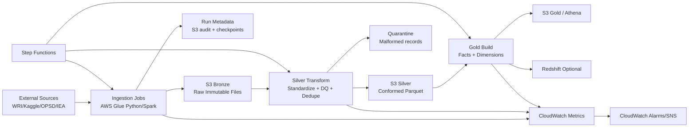

# Architecture and Data Flow

## Design principles

- Production-first architecture with modular IaC and CI/CD
- Medallion model (Bronze/Silver/Gold)
- Kimball dimensional marts for BI consumption
- Idempotent and replay-safe ingestion semantics
- Observability-first (data quality + freshness + latency)

## Logical architecture

## Physical AWS components

- Amazon S3 data lake buckets/prefixes:
  - bronze/
  - silver/
  - gold/
  - quarantine/
  - audit/
- AWS Glue Catalog databases:
  - gppa_bronze
  - gppa_silver
  - gppa_gold
- AWS Glue jobs:
  - bronze_ingest_power_plants
  - silver_transform_power_plants
  - gold_build_power_analytics
- AWS Step Functions:
  - state machine for orchestration and retry/replay
- Amazon Athena:
  - interactive SQL and BI views over Gold data
- Amazon CloudWatch:
  - metrics, alarms, and logs

## Data model overview

Dimensions:
- DimPlant
- DimCountry
- DimFuelType
- DimTime

Facts:
- FactPlantCapacity
- FactPowerGeneration

## Partition strategy

Bronze:
- ingest_year=YYYY/ingest_month=MM/ingest_day=DD/source_name=...

Silver:
- event_year=YYYY/event_month=MM/country_code=XX

Gold:
- year=YYYY/country_code=XX/fuel_group=...

## Late-arriving and replay strategy

- Event-time column retained from source when available
- Watermark-based incremental window to include late arrivals
- Checkpoint table stores last successful event timestamp and file hashes
- Replay mode reprocesses a bounded date window idempotently
