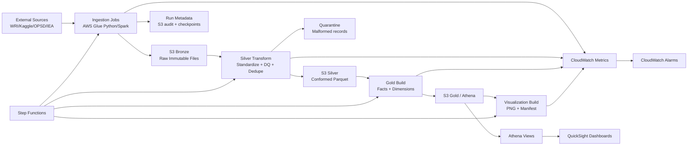

# Architecture and Data Flow

## Design principles

- Production-first architecture with modular IaC and CI/CD
- Medallion model (Bronze/Silver/Gold)
- Kimball dimensional marts for BI consumption in QuickSight
- Idempotent and replay-safe ingestion semantics
- Observability-first (data quality + freshness + latency)

## Deployed baseline (current)

- AWS Account: `371170753734`
- AWS Region: `us-east-1`
- Data lake bucket: `gppa-main-lake-platform-20260710212811`
- Step Functions ARN: `arn:aws:states:us-east-1:371170753734:stateMachine:gppa-main-power-pipeline`
- Athena workgroup: `gppa-main-wg`
- QuickSight Athena data source ARN: `arn:aws:quicksight:us-east-1:371170753734:datasource/gppa_main_athena`

## Logical architecture

## Physical AWS components

- Amazon S3 data lake buckets/prefixes:
  - bucket: gppa-main-lake-platform-20260710212811
  - bronze/
  - silver/
  - gold/
  - quarantine/
  - audit/
- AWS Glue Catalog databases:
  - gppa_bronze
  - gppa_silver
  - gppa_gold
- AWS Glue jobs:
  - gppa-main-bronze-ingest-power-plants
  - gppa-main-silver-transform-power-plants
  - gppa-main-gold-build-power-analytics
  - gppa-main-visualizations-build
- AWS Glue crawlers:
  - gppa-main-bronze-crawler
  - gppa-main-silver-crawler
  - gppa-main-gold-crawler
- AWS Step Functions:
  - arn:aws:states:us-east-1:371170753734:stateMachine:gppa-main-power-pipeline
- Amazon Athena:
  - workgroup: gppa-main-wg
- Amazon QuickSight:
  - data source: arn:aws:quicksight:us-east-1:371170753734:datasource/gppa_main_athena
- Amazon CloudWatch:
  - metrics, alarms, and logs

## Data model overview

Dimensions:

- DimPlant
- DimCountry
- DimFuelType
- DimTime

Facts:

- FactPlantCapacity
- FactPowerGeneration

## Partition strategy

Bronze:

- ingest_year=YYYY/ingest_month=MM/ingest_day=DD/source_name=...

Silver:

- event_year=YYYY/event_month=MM/country_code=XX

Gold:

- year=YYYY/country_code=XX/fuel_group=...

## Late-arriving and replay strategy

- Event-time column retained from source when available
- Watermark-based incremental window to include late arrivals
- Checkpoint table stores last successful event timestamp and file hashes
- Replay mode reprocesses a bounded date window idempotently

## BI scope

- BI scope is QuickSight-only for active delivery
- Dashboard evidence is maintained as PDFs under dashboards/
